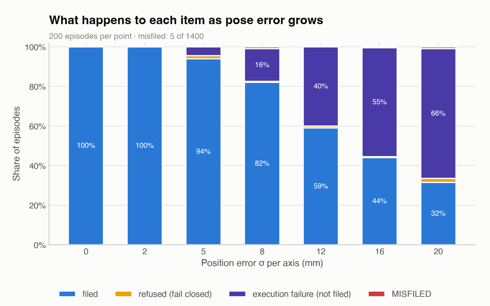
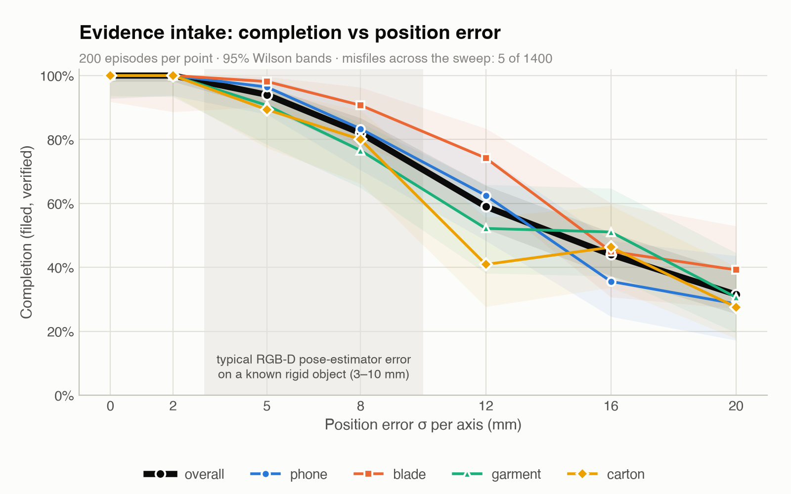

# Physical AI — Evidence Room POC

A simulation proof-of-concept of **robotic evidence intake**. An officer seals evidence in a bag, applies a barcode
label and leaves it at the intake hatch. A rail-mounted Franka Panda then:
1. reads the label from camera pixels;
2. looks up the case;
3. routes the bag by evidence category to one of three lockers (12 slots);
4. traverses the rail;
5. re-scans the bag at the slot to confirm it holds the right item;
6. files it.

A tamper-evident chain-of-custody record writes itself as it goes. Anything it cannot read, match or verify, it
**refuses**: the bag is left on the counter for a human, and never guessed.

**The robot never handles unsealed evidence.** Sealing and labelling stay with the officer; the robot moves a sealed,
labelled unit and records the movement. That is a deliberate design property, not a limitation.

Everything runs on a MacBook Air M2, CPU only, in [MuJoCo](https://mujoco.org) 3.x. No physical robot, no cloud
compute, no learned policy.

## What the measurements support

*The robot files evidence by reading its label, verifies before it commits, and refuses rather than guessing
whenever it cannot read or match an item. Across 3,400 randomised episodes it never read a wrong ID. With perfect
pose information it misfiled nothing (0 of 1,200). With pose error on its input, 5 of 1,200 bags (0.4%) physically
ended up in the neighbouring bin after correct identification and routing. None of those was ever recorded as a
successful filing.*

That is weaker than the target of "failures are always refusals, never errors", and the difference is stated plainly
below.

## Measured results (Phase 1)

3,400 randomised episodes: a zero-noise baseline, a position-error sweep and an out-of-distribution sweep, 200
episodes per point, all custody chains intact. Full detail: `NOTES.md`, "Phase 1".

### 1. Misfiles (the headline safety metric; target zero)

| Condition | Misfiles | 95% CI (Wilson) |
|---|---|---|
| Perfect pose information, 1,200 episodes | **0** | 0 – 0.32% |
| Pose error σ 2–20 mm, 1,200 episodes | **5** | 0.18 – 0.97% |
| Oversize/overweight items (×1.0–2.0), 1,000 episodes | 0 | 0 – 0.38% |

- **The target of zero was not met under pose error.** All five misfiles have the same physical cause. The label was
  read correctly and the bag routed correctly, but an off-centre grasp tipped the bag at release and it crossed the
  low divider into the neighbouring bin of the right locker. In one case it slipped during transit instead.
- **What held:** zero misreads in 3,400 episodes, zero verify mismatches, and no misfile was ever logged as VERIFIED.
  All five were logged FAILED. In simulation that post-release check reads ground truth, so a real cell needs a
  slot-occupancy sensor to raise the same alert.
- Remedies are identified but deliberately not applied during measurement:
  - a taller internal divider (it can be raised without the hand-clearance problem that limits the outer walls);
  - refusing or re-grasping off-centre bags using the verify-scan image;
  - a physical post-release slot check.



### 2. Refusals (the system working as designed)
- **Perfect pose:** 3 of 1,200, all verify-scan no-reads. A carton whose contents sat off-centre pivoted up to 46° in
  the grasp, so the wrist camera saw its label too obliquely to read. The robot refused and put the bag back.
- **Under pose error:** 11 of 1,200, all verify no-reads. The intake scanner is fixed, so pose error never costs an
  intake read.
- **Deliberately exercised by tests:** unregistered labels, damaged labels, full lockers and a label swapped in
  transit. All four are refused.

### 3. Completion (filed and verified without human help)

| Pose error σ per axis (mm) | 0 | 2 | 5 | 8 | 12 | 16 | 20 |
|---|---|---|---|---|---|---|---|
| Completion | 99.75% (1,200 ep.) | 100% | 94.0% | 82.0% | 59.0% | 44.0% | 31.5% |



- Completion drops below 95% at about 4.5 mm, below 80% at about 8.3 mm and below 50% at about 14.4 mm. It is lower
  than Phase 0 at every noisy level, as expected: offset contents, longer bags, and a verify scan that can refuse.
- **Under pose error, unfiled items are mostly execution failures, not refusals.** Usually a finger lands on the bag
  as the gripper comes down. These are logged FAILED and the bag is not filed.
- **Out of distribution** (items bigger and heavier than the design range), completion is 100% at ×1.0, 3% at ×1.25
  and 0% beyond. Bags are sized close to the 245 mm bins and the 80 mm finger stroke, so there is essentially no
  headroom.

### 4. Barcode scanning (real Code128, decoded from rendered pixels with zxing-cpp)
- Intake: 100% at perfect pose and under pose error. Verify scan: 99.6% on the first attempt at perfect pose, 98.7%
  under pose error.
- Blurring the image degrades the read rate steeply: 92% at about half a bar width of blur, 30% at 0.7, 0% beyond.
  That produced **zero misreads in 700 degraded decodes**: a bad image becomes a refusal, not a wrong ID. The clean
  100% is a property of the simulated camera, not a field read rate.

### Earlier phases
- **Phase 0:** a scripted pick-and-place of rigid objects with perfect state. 1,000/1,000 filed.
- **Phase 0B:** the same system with pose error injected. Completion falls below 95% at about 6 mm (tag `phase0b`).
- Milestone tags `m0`–`m7` mark the Phase 0 build history.

## How it works
- **Evidence units:** sealed polythene bags in four content classes: phone, blade, garment and carton. Size, mass,
  friction, pose, lighting and an **offset centre of mass** (contents settle to one end) are randomised every
  episode.
- **The workflow:** `IDLE → SCAN → ROUTE → APPROACH → DESCEND → CLOSE → LIFT → TRAVERSE → TRANSIT → VERIFY_SCAN →
  INSERT → RELEASE → RETREAT → HOME`. Every phase has a measured completion condition and a timeout.
- **Two cameras:**
  - **Intake scanner:** a fixed 4000 × 3260 camera over the counter. If the label won't read, the robot tries exactly
    one re-scan from a second pose, then refuses.
  - **Wrist cameras:** a pair on the hand for the verify scan. A mismatch means refuse and return the bag to the
    counter.
- **Routing:** decoded ID → case record → category (narcotics → CAB-A, weapons → CAB-B, general → CAB-C) → first
  free slot. An unknown ID or a full locker means refuse.
- **Identity boundary:** the controller never sees the simulator's true item ID, only what it decodes. The evaluator
  alone uses the truth, to detect misfiles. A test proves it: a mislabelled item is filed where its label says, and
  the evaluator flags the misfile.
- **Custody log:** append-only, SHA-256 hash-chained. It records the decoded barcode, which camera read it and when,
  and whether the verify scan matched. REFUSED and FAILED are separate outcomes.
- **Grasping:** contact physics only. There is no weld or kinematic attachment, and the gripper force is set to about
  21 N per pad.

## Scope (disclosed)
- **Simulation only.** Sim-to-real transfer is not measured.
- **Scripted controller, no learned policy.** The RL scaffold in `rl/` is plumbing only.
- **No pose-estimation model.** Pose error is injected into the controller's input at stated levels. Barcode reading
  is genuinely from rendered pixels.
- **Bags are gripper-limited.** They are long, narrow pouches (20–24 × 4–7 cm), because the Panda hand opens to 80 mm
  and the label must sit clear of the hand for the verify scan. Real evidence bags are wider.
- **One item per episode.** Locker occupancy is tracked logically, and a full locker is emptied between episodes.
- **The demo video** runs with a stated 5 mm pose error. It shows three natural episodes, with seeds chosen only so
  all three lockers are visited (never by outcome), and one refusal, clearly labelled as a deliberate damaged-label
  test item.

## Setup

Requirements: Apple Silicon Mac (or any machine that runs MuJoCo), Python 3.13.

```bash
pip3 install -r requirements.txt
```

The Franka Emika Panda model comes from [MuJoCo Menagerie](https://github.com/google-deepmind/mujoco_menagerie) and
is not committed. Fetch it with a sparse checkout:

```bash
git clone --depth 1 --filter=blob:none --sparse https://github.com/google-deepmind/mujoco_menagerie.git /tmp/menagerie
cd /tmp/menagerie && git sparse-checkout set franka_emika_panda && cd -
cp -r /tmp/menagerie/franka_emika_panda/. ./models/panda/
```

Three committed files already live in `models/panda/` and must stay beside `panda.xml` so asset paths resolve:
- `evidence_intake.xml` (the scene);
- `panda_railed.xml` (the robot on its rail);
- `labels/` (the barcode label textures).

The build used Menagerie commit `367e3d9`. Optional RL dependencies: `pip3 install -r requirements-rl.txt`.

## Usage

```bash
mjpython scripts/simulation.py                       # interactive viewer (macOS needs mjpython)
python3 scripts/simulation.py --headless             # render the scene to out/scene.png
python3 scripts/episode.py --episodes 5 --seed 0     # intake episodes, custody log to out/custody_log.jsonl
python3 scripts/episode.py --episodes 1 --label damaged        # watch a refusal
python3 scripts/evaluate.py --episodes 100 --seed 0  # misfiles-first evaluation table + out/eval_<ts>.json
python3 scripts/evaluate.py --pos-noise-mm 8         # same, with pose error on the controller's input
python3 scripts/sweep.py --only baseline position ood          # the Phase 1 sweeps (~35 min)
python3 scripts/plot_phase1.py out/robustness_<ts>.json        # charts
python3 scripts/scan_degradation.py                  # barcode read rate under blur and noise
python3 scripts/record.py                            # workflow video to out/demo_<timestamp>.mp4
python3 scripts/logger.py --verify out/custody_log.jsonl       # verify any custody log (exit 1 if tampered)
python3 tests/test_workflow.py                       # identity boundary and refusal paths (also test_*.py)
```

Any evaluation episode replays exactly from its seed and prior locker occupancy, both recorded in the JSON:
`python3 scripts/episode.py --episodes 1 --seed <seed> --occupied <comma-separated locations>`.
Outputs go to `out/`, which is gitignored; `out/ARTIFACTS.md` lists what is worth keeping and where it came from.

## Repository layout

See `CLAUDE.md` for the full map. In short:
- `models/panda/`: the scene and the railed robot.
- `scripts/`: the simulation, perception seam, scanner, routing, controller, evaluation, plots and video.
- `tests/`: custody log, perception seam, routing, and the workflow boundary.
- `rl/`: the Gymnasium scaffold.
- `docs/`: the charts shown here.

## Next steps
1. Close the physical misfile path: a taller internal divider, in-hand pose checked from the verify-scan image before
   release, and a post-release slot-occupancy sensor. Then re-measure.
2. Buy down position error, especially depth: a real pose estimator behind `scripts/perception.py`, measured
   against the same sweep.
3. Decide how to handle items outside the envelope (refuse at intake, or a wider gripper).
4. GPU-parallel simulation and a policy bootstrapped from the scripted controller; then the sim-to-real loop on
   hardware.
