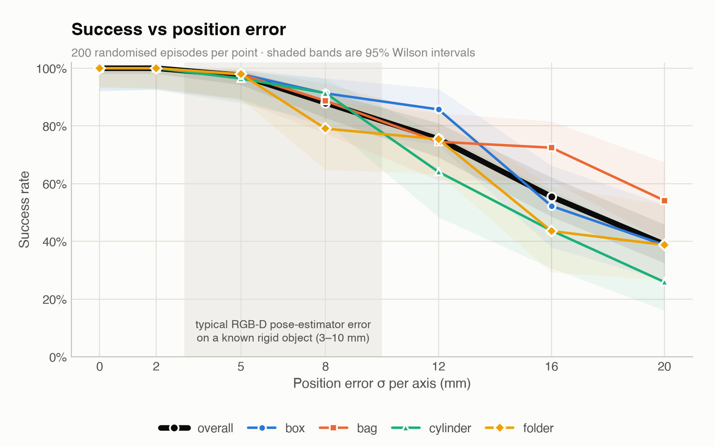

# Physical AI — Evidence Room POC

A simulation proof-of-concept for robotic evidence intake: a Franka Emika Panda arm picks randomised evidence items
from an intake counter and files them into an addressed evidence locker. A tamper-evident chain-of-custody record
writes itself as the work happens, and a headless evaluation harness measures the whole loop, including how it
degrades when the robot's estimate of the item's pose is wrong.

**Headline:** reliable within its randomisation envelope when it knows exactly where the item is; overall success
drops below 95% beyond about 6 mm of per-axis pose error and below 80% beyond about 11 mm. No perception model, no
learned policy, simulation only, four object classes.

Everything runs on a MacBook Air M2, CPU only, in [MuJoCo](https://mujoco.org) 3.x. There is no physical robot and
no cloud compute.

## What exists (Phase 0 and 0B)

| | What it is | Status |
|---|---|---|
| Evidence room scene | Panda on an intake counter, a 2×2 cabinet of open-topped bins with named slot sites, four item classes | Works (`scripts/simulation.py`) |
| Pick-and-place | Damped least-squares IK and a phase-by-phase state machine; each phase has a measured completion condition and a timeout | Works; **grasping is pure contact physics — no weld or kinematic attachment** |
| Chain-of-custody log | Append-only JSON Lines with SHA-256 hash chaining; `verify()` finds the first tampered record | Works; 8 tamper tests pass |
| Domain randomisation | Item class, size, mass, friction, pose, lighting; seeded and exactly replayable | Works |
| Evaluation harness | N randomised episodes: success with Wilson 95% CIs, per class, per slot, failures by phase, cycle time, placement error, slip rate | Works |
| Perception seam | `scripts/perception.py`: the only item state the controller may use; injects a fixed per-episode pose/size error | Works; tests prove the evaluator stays on ground truth |
| Robustness sweeps | Success vs position, yaw, combined and size error, and vs out-of-distribution item size/mass | Done: 6,200 + 800 episodes, charts in `out/` |
| Demo video | 1280×720 MP4 with a live custody-log panel, recorded under a stated 5 mm / 5° pose error | Works (`out/demo_phase0b.mp4`, ~86 s) |
| RL scaffold | Gymnasium env (Cartesian action space) and SB3 trainer | Plumbing verified; **no policy trained** (see below) |

## Measured results

### With perfect state (the controller reads the true item pose)

Scripted controller, randomised episodes, Phase 0 code at commit `e893af9` (tag `m5`):

| Run | Success | 95% CI (Wilson) | Grasp slips | Placement error (mean / p95) | Cycle time (mean / p95) |
|---|---|---|---|---|---|
| 100 episodes, seeds 0–99 | 100/100 | 96.3–100% | 0 | 1.3 / 3.3 mm | 12.6 / 13.9 s |
| 1000 episodes, seeds 1000–1999 | 1000/1000 | 99.6–100% | 0 | 1.3 / 3.5 mm | 12.7 / 14.2 s |

Per class (1000-episode run): box 230/230, bag 258/258, cylinder 253/253, folder 259/259. Every slot: 250/250. The
custody chain stayed intact across all 5000 events.

### Read these numbers with their conditions

- **The controller is scripted and reads each item's ground-truth pose from the simulator.** There is no
  perception and no pose noise. This is the biggest gap between these numbers and a real cell.
- **The test set comes from the design distribution.** The randomisation ranges were chosen so every item fits the
  Panda gripper and the bins, and the grasp heuristics were written for exactly these four classes.
- One item at a time on an uncluttered counter, always resting upright or flat.
- This is simulated contact physics. **Sim-to-real transfer is not measured.**
- The honest claim: *within this randomisation envelope, with perfect state information, the contact-physics
  pipeline plus the logging, evaluation and replay infrastructure is reliable.* It is not a claim about real-world
  grasp success, general-purpose grasping, or a learned policy.

An earlier 1000-episode run measured 996/1000. All four failures were a false negative in the grasp verifier, caused
by MuJoCo contact flicker; they were diagnosed by exact replay and fixed. The history is kept in `NOTES.md` (M5).
Across the Phase 0B zero-noise sweep points, a further 1000 episodes gave 998/1000: two short, wide bottles failed
at release. Those are real failures, and are documented but deliberately not fixed during measurement.

### With pose error on the controller's input (Phase 0B)

The robot's *belief* about the item is perturbed once per episode; the item itself never moves, and success is
always judged from the true simulator state. 200 randomised episodes per point, fresh seeds per point.



| Error σ | 0 | 2 | 5 | 8 | 12 | 16 | 20 |
|---|---|---|---|---|---|---|---|
| Position, per axis x/y/z (mm) | 100% | 100% | 97.5% | 88.0% | 75.5% | 55.5% | 39.0% |
| Yaw (°) | 100% | 100% | 100% | 100% | 100% | 97.0% | 96.0% |
| Both together (k mm + k°) | 100% | 100% | 97.5% | 83.0% | 61.0% | 40.5% | 35.0% |

- **Where it breaks:** overall success falls below 95% at σ ≈ 5.8 mm, below 80% at ≈ 10.6 mm, and below 50% at
  ≈ 17.3 mm. Across 3–10 mm (a typical error range for an RGB-D pose estimator on a known rigid object; this range
  is an assumption, not measured here) success falls from ~99% to ~82%. The grasp tolerance sits *inside*, not
  comfortably below, what real perception would deliver.
- **Position dominates; yaw barely matters.** Yaw error stays ≥ 95% up to σ ≈ 21° (80% at ≈ 37°). Depth error
  hurts on its own beyond ~10 mm.
- **Failure mode:** almost always a finger landing on the item during the descent, or closing on nothing, rather
  than the item slipping in transit. The thin folder degrades first (only ~1 cm of lateral clearance per side),
  then the tall bottle.
- **Out of distribution:** scaling item size and mass beyond the training envelope, success falls below 95% at
  ×1.08, 80% at ×1.28 and 50% at ×1.44. The envelope was designed right up to the gripper's 80 mm stroke and the
  245 mm bins, so there is almost no headroom.

Full breakdown by class, phase and actual drawn error: `NOTES.md`, "Task B".

## Scope and modelling choices (disclosed)

- **Four item classes only:** rigid box (phone box), sealed bag, cylinder (bottle), flat folder/document.
  - The **folder** is a slim 18 × 6 × 2 cm document wallet. A real A4 folder lying flat cannot be grasped top-down by
    a parallel-jaw gripper at all; it would need suction or a different end effector.
  - The **bag** is a rigid ellipsoid with rolling and torsional friction standing in for a deformable bag.
  - The **bottle** stands upright and is at most ~14 cm tall. It is gripped as close to mid-height as the hand allows.
- **Gripper force was raised** from Menagerie's stock setting (~1.4 N per pad, which cannot lift 0.5 kg) to ~21 N per
  pad. The real Franka Hand is rated at 70 N continuous.
- **Gravity compensation is enabled on the arm links**, as on the real Franka controller. It is never applied to items.
- **The cabinet is four open-topped bins.** A closed cabinet with a horizontal shelf would make top-down insertion
  into the lower row impossible. Items are released from just above the bin walls, because the 208 mm-wide Panda
  hand does not fit inside a bin.
- **Only one item is physically simulated per episode.** The cabinet is physically empty at the start of every
  episode. Slot occupancy is tracked logically, so all four slots get exercised.
- **The demo video runs under a stated pose error** (σ 5 mm per axis + 5° yaw). The overlay shows that level, the
  success rate measured at it (97.5%), and each episode's actual drawn error.
- **The demo video's final episode is a deliberate fault injection,** labelled as such on screen. The gripper is cut
  back to its stock force, so the video can show a failure being detected and logged. It is not a natural failure.
- **Visual-only scene dressing** (locker shell, evidence tags, matte floor) never collides and adds no mass. The same
  100 seeds are bit-identical before and after it. The tags do not scale with randomised item size.
- **RL:** the Gymnasium environment passes `check_env`. A hand-written policy acting only through its 5-D action
  space solves 60/60 episodes, and SAC/PPO smoke runs checkpoint and reload correctly. Training a policy to
  convergence was not attempted; realistically that needs GPU-parallel simulation. `NOTES.md` (M7) has the estimate.

## Setup

Requirements: Apple Silicon Mac (or any machine that runs MuJoCo), Python 3.13.

```bash
pip3 install -r requirements.txt
```

The Franka Emika Panda model comes from [MuJoCo Menagerie](https://github.com/google-deepmind/mujoco_menagerie) and
is not committed. Fetch it with a sparse checkout:

```bash
git clone --depth 1 --filter=blob:none --sparse https://github.com/google-deepmind/mujoco_menagerie.git /tmp/menagerie
cd /tmp/menagerie && git sparse-checkout set franka_emika_panda && cd -
cp -r /tmp/menagerie/franka_emika_panda/. ./models/panda/
```

The scene file `models/panda/evidence_room.xml` is committed. It must stay beside `panda.xml` so MuJoCo resolves
the asset paths. The build used Menagerie commit `367e3d9`.

Optional RL dependencies (these pull in PyTorch):

```bash
pip3 install -r requirements-rl.txt
```

## Usage

```bash
mjpython scripts/simulation.py                     # interactive viewer (macOS needs mjpython for the passive viewer)
python3 scripts/simulation.py --headless           # render demo_cam to out/scene.png
python3 scripts/controller.py                      # one scripted cycle, box -> slot_0, frames to out/m2_*.png
python3 scripts/episode.py --episodes 10 --seed 0  # randomised intake episodes, custody log to out/custody_log.jsonl
python3 scripts/evaluate.py --episodes 100 --seed 0  # evaluation table + out/eval_<timestamp>.json
python3 scripts/evaluate.py --pos-noise-mm 5 --yaw-noise-deg 5   # same, with pose error on the controller's input
python3 scripts/sweep.py                           # robustness sweeps, 200 episodes per point (~8 min on 8 cores)
python3 scripts/plot_robustness.py out/robustness_<ts>.json      # charts to out/robustness_*.png
python3 scripts/record.py                          # demo video to out/demo_<timestamp>.mp4 (σ 5 mm / 5° by default)
python3 scripts/logger.py --verify out/custody_log.jsonl   # verify any custody log (exit code 1 if tampered)
python3 scripts/logger.py --demo                   # write a demo log, then catch a deliberate edit
python3 tests/test_custody_log.py                  # tamper-evidence tests
python3 tests/test_perception.py                   # proves noise reaches only the controller
python3 rl/train.py                                # RL smoke test (SAC, 3000 steps) - plumbing only
```

To replay any evaluation episode exactly, take its seed and slot from the eval JSON:

```bash
python3 scripts/episode.py --episodes 1 --seed 1739 --slot slot_1
```

All outputs go to `out/`, which is gitignored; `out/ARTIFACTS.md` lists what is worth keeping and where it came from.
Milestone tags `m0`–`m7` mark the Phase 0 build history.

## Repository layout

```
physical-ai-poc/
├── CLAUDE.md                   project context
├── BUILD_BRIEF.md, PHASE_0B_BRIEF.md   build specifications
├── docs/robustness_curve.png   the headline chart (copy of out/robustness_curve.png)
├── NOTES.md                    decisions, failures found and fixed, measured results, open items
├── requirements.txt            mujoco, numpy, imageio, imageio-ffmpeg, pillow, matplotlib
├── requirements-rl.txt         gymnasium, stable-baselines3 (optional)
├── models/panda/               vendored Menagerie Panda (gitignored) + evidence_room.xml (committed)
├── scripts/
│   ├── scene.py                model loading (adds the tcp site, gripper tuning), name lookups, rendering
│   ├── simulation.py           interactive viewer / --headless render
│   ├── ik.py                   damped least-squares IK
│   ├── controller.py           pick-and-place state machine, grasp predicates
│   ├── perception.py           the perception seam: the controller's only view of the item
│   ├── randomise.py            in-place domain randomisation
│   ├── logger.py               hash-chained custody log
│   ├── slots.py                slot allocation
│   ├── episode.py              one full intake episode
│   ├── evaluate.py             N-episode evaluation (optionally with pose noise / OOD scaling)
│   ├── sweep.py                robustness sweeps
│   ├── plot_robustness.py      robustness charts
│   └── record.py               demo video with custody panel
├── rl/
│   ├── env.py                  Gymnasium environment
│   └── train.py                SB3 smoke-test trainer
├── out/ARTIFACTS.md            manifest of generated artefacts (everything else in out/ is gitignored)
└── tests/                      test_custody_log.py, test_perception.py
```

## Next steps

1. Buy down position error, especially depth: better than ~5 mm perception, or grasp behaviour that tolerates it
   (a force-guarded descent that stops on contact instead of timing out, a re-observe step before closing).
2. Put a real pose estimator behind `perception.py` and re-run the same sweep with its measured error.
3. Fix the known release failure mode (a windowed release check, as the grasp check already has). Decide on
   out-of-envelope items: refuse them, or use a wider gripper.
4. Move to GPU-parallel simulation (MJX / MuJoCo Warp) and train a policy bootstrapped from the scripted
   controller's demonstrations.
5. Close the sim-to-real loop on hardware.
